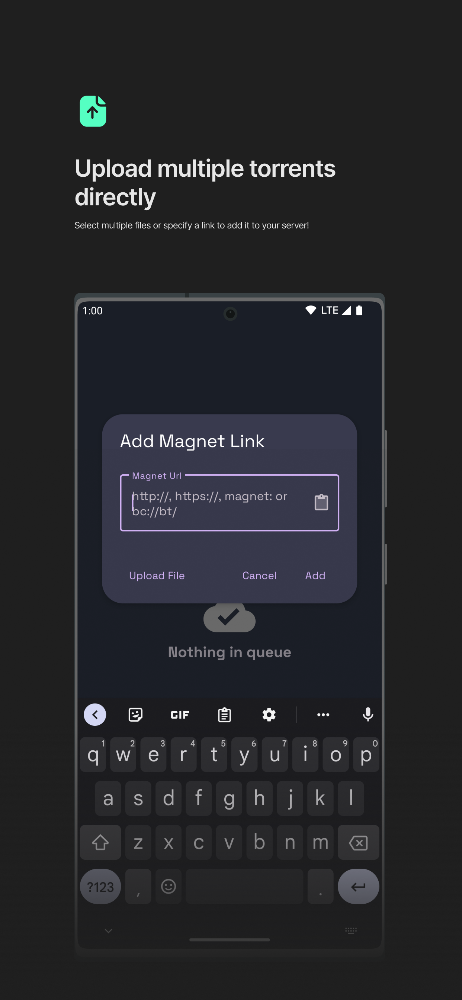

# qBittorrent-Manager 🚧

This is the repository for **_qBittorrent Manager_**, an Android app for managing [qBittorrent](http://www.qbittorrent.org/) remotely, written in Kotlin.

## Download

## Previews

  
  
  
  
  
  

## License

See [LICENSE](LICENSE.txt)
