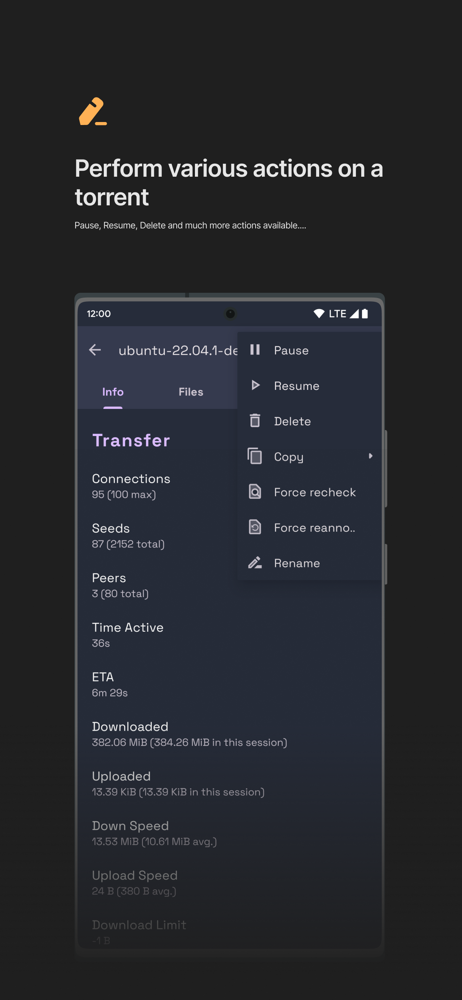

# qBittorrent-Manager 🚧

This is the repository for **_qBittorrent Manager_**, an Android app for managing [qBittorrent](http://www.qbittorrent.org/) remotely, written in Kotlin.

**I mostly work on this project in my free time, so the development may be slow.**

 Maintenance of this project is made possible by all the <a href="https://github.com/Yash-Garg/qBittorrent-Manager/graphs/contributors">contributors</a> and <a href="https://github.com/sponsors/Yash-Garg">sponsors</a>. If you'd like to sponsor this project and have your avatar or company logo appear below <a href="https://github.com/sponsors/Yash-Garg">click here</a>. 💖

&nbsp;&nbsp;

## Download

## Previews

  
  
  
  
  
  

## License

See [LICENSE](LICENSE.txt)
